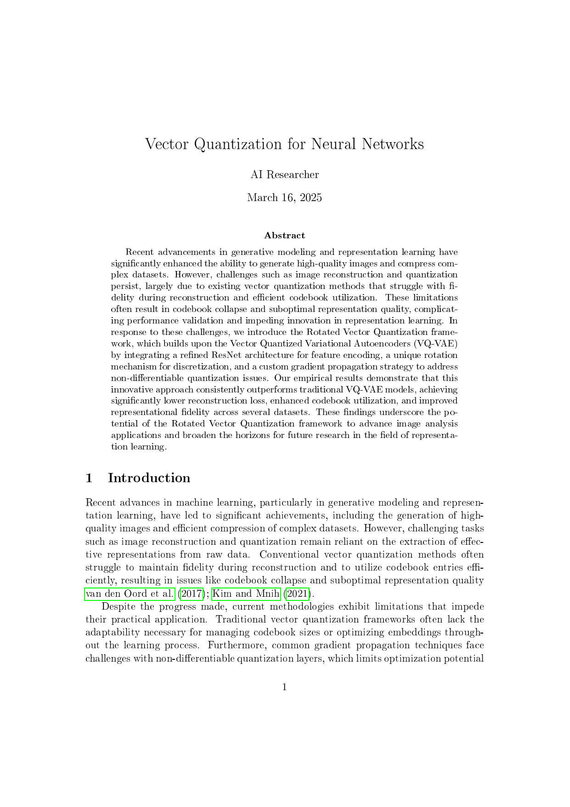
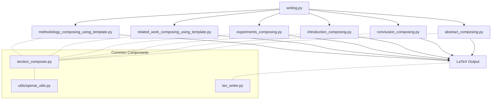

# Paper Agent

A framework for automated academic paper writing using AI agents and templates.

## Overview

Paper Agent uses specialized AI agents to compose research papers by generating different sections (introduction, methodology, experiments, results, etc.) in a structured manner. It supports multiple research fields and manages the complete paper generation process.



*Above: Example of a paper generated with the Vector Quantization model*

## Features

- Multi-agent system for collaborative paper writing
- Support for different research fields (VQ, GNN, Diffusion, etc.)
- Template-based section generation
- LaTeX output for professional papers
- Checkpoint system to save progress

## Installation

### Using pip

```bash
# Clone the repository
git clone https://github.com/yourusername/paper-agent.git
cd paper-agent

# Create a virtual environment
python -m venv venv
source venv/bin/activate  # On Windows: venv\Scripts\activate

# Install dependencies
pip install -r requirements.txt
```

### Using conda

```bash
# Clone the repository
git clone https://github.com/yourusername/paper-agent.git
cd paper-agent

# Create and activate conda environment
conda env create -f environment.yml
conda activate paper-agent
```

## Usage

### Windows

1. Set up API keys in a custom PowerShell script:

```powershell
# Example: run_paper_custom.ps1
$env:ANTHROPIC_API_KEY = "your-anthropic-key"
$env:OPENAI_API_KEY = "your-openai-key"
$env:GEMINI_API_KEY = "your-gemini-key"

# Set the research field and instance ID
$research_field = "vq"  # Options: vq, gnn, rec, diffu_flow
$instance_id = "rotated_vq"

# Run the paper writing script
python writing.py --research_field $research_field --instance_id $instance_id
```

2. Run the script:

```
./run_paper_custom.ps1
```

### Ubuntu/macOS

1. Set up API keys in a custom bash script:

```bash
# Example: run_paper_custom.sh
export ANTHROPIC_API_KEY="your-anthropic-key"
export OPENAI_API_KEY="your-openai-key"
export GEMINI_API_KEY="your-gemini-key"

# Set the research field and instance ID
research_field="vq"  # Options: vq, gnn, rec, diffu_flow
instance_id="rotated_vq"

# Run the paper writing script
python writing.py --research_field $research_field --instance_id $instance_id
```

2. Make the script executable and run it:

```bash
chmod +x run_paper_custom.sh
./run_paper_custom.sh
```

## Project Structure

The Paper Agent architecture follows a modular design with specialized components for each section of an academic paper.



### Core Components

- **Entry Point**
  - `writing.py`: Main orchestrator that calls each composition module sequentially

- **Base Classes**
  - `section_composer.py`: Abstract base class with common utilities for all section composers

- **Section Composition Modules**
  - `methodology_composing_using_template.py`: Creates the methodology section with technical details
  - `related_work_composing_using_template.py`: Generates the related work section
  - `experiments_composing.py`: Builds the experiments section with results
  - `introduction_composing.py`: Produces the introduction section
  - `conclusion_composing.py`: Creates the conclusion section
  - `abstract_composing.py`: Generates the abstract section

- **LaTeX Handling**
  - `tex_writer.py`: Complex LaTeX document management
  - `tex_writer_simplified.py`: Streamlined LaTeX document generation
  - `tex_output/`: Directory for generated LaTeX files and compiled PDFs

- **Project Organization**
  - `[research_field]/`: Research field directories (vq, gnn, rec, diffu_flow)
    - `[instance_id]/`: Specific instances (e.g., rotated_vq)
      - `cache_1/agents/`: Agent configurations and outputs
      - `workplace/`: Working files for paper generation
        - `project/`: Project-specific code and assets
        - `papers/`: Related papers for citation
    - `writing_templates/`: Templates for different section types
    - `target_sections/`: Output directory for generated section content
    - `[section]_checkpoints/`: Checkpoint files for section composition

- **Execution Scripts**
  - `run_paper_template.ps1`: PowerShell template for Windows
  - `run_paper_template.sh`: Bash template for Ubuntu/macOS
  - `run_paper_custom.ps1`: Custom PowerShell script with API keys
  - `run_paper_custom.sh`: Custom Bash script with API keys

## Requirements

- Python 3.8+
- LaTeX distribution (for PDF compilation)
- API keys for Anthropic Claude, OpenAI, and Google Gemini

## License

MIT
